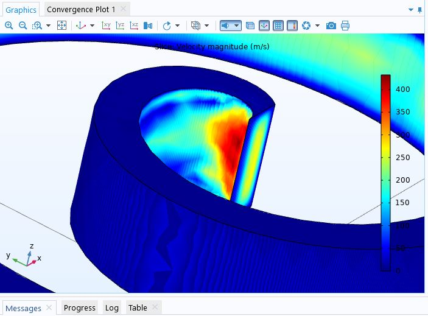

# PhysiForge: Unveiling Multiphysics

Welcome to PhysiForge, your portal to unveil the wonders of multiphysics modeling and anomaly analysis! This repository serves as a hub for exploring complex interactions between various physical phenomena, addressing anomalies in meshing and design, and optimizing system performance across diverse applications.

## About

PhysiForge is dedicated to pushing the boundaries of understanding multiphysics systems through comprehensive simulations and in-depth analyses. Our mission is to unlock hidden insights, tackle meshing anomalies and design defects, and pave the way for breakthroughs in engineering and scientific research.

## Key Features

### Multiphysics Simulations

Dive into a diverse array of simulation models spanning fluid dynamics, heat transfer, electromagnetics, structural mechanics, and beyond.

### Anomaly Analysis

Delve deep into meshing anomalies and design defects using advanced techniques to enhance simulation accuracy and reliability.

### Design Optimization

Discover optimal configurations and parameter ranges through parametric studies and iterative design refinement strategies.

### Insights and Results

Access detailed analyses, visualization results, and key insights derived from our simulations, providing valuable knowledge for advancing multiphysics understanding.

## Contents

- **Simulations**: Explore simulation files organized by application area, physics domain, and simulation type.
- **Results**: Access visualization results, performance metrics, and anomaly analyses for each simulation case.
- **Documentation**: Find user guides, tutorials, and technical documentation to aid in understanding and utilizing the repository contents effectively.

## Getting Started

To begin your journey with PhysiForge, follow these steps:

1. Clone the repository to your local machine.
2. Explore the directories to discover simulations of interest.(More coming soon)
3. Review the README files within each simulation folder for specific instructions and details.
4. Experiment with different simulation parameters, analyze results, and gain insights into multiphysics phenomena.
5. Join our community discussions, share your findings, and contribute to advancing the field of multiphysics modeling.

## Contributing

We welcome contributions from the community to enrich and expand PhysiForge. Whether it's enhancing simulation models, refining analysis techniques, or sharing new insights, your contributions are invaluable. Please refer to our [Contribution Guidelines](CONTRIBUTING.md) for details on how to get involved.

## Support

If you have questions, or suggestions, or encounter any issues while using PhysiForge, please don't hesitate to [open an issue](../../issues) or reach out to the repository maintainers for assistance.

## License

This repository is licensed under the [MIT License](LICENSE), allowing for unrestricted use, modification, and distribution of the code and associated documentation.
